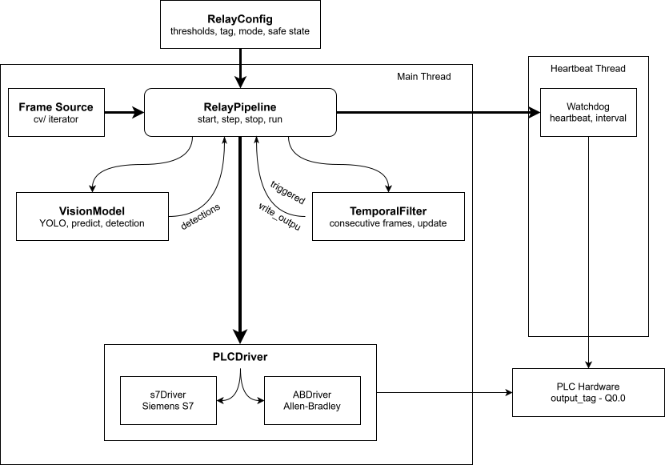

# Relay
Scripts i used to connect YOLO machine vision to PLC

This starteed as a collection of scripts i wrote for my last work term, making it easier to connect YOLO to a PLC without needing Cognex and Keyence. I finally cleaned it up into a proper package for practice and configured for my own work, not a published library. Probably wont work out the box for most people either

again this was mainly a learning experaince for packaging CV applications and writing test code using tools like pytest

# How it works (in theory)

### Main Thread
`RelayConfig` sits on top, feeding thresholds, tag names, and modes into the pipeline. `RelayPipeline` is what calls all the shots, on each `step()` call it pushes the frame into `VisionModel`, taking the top detection back and runs it through a `TemporalFilter`. The filter only triggers when the same label clears the confidence thresh for `consecutive_frames` in a row, if the conf drops or the label changes, the streak is reset. When the filter triggers, `write_output` goes to the selected `PLCDriver` (either `s7Driver` or `ABDriver`) and then straight to the PLC

### Watchdog Thread
In stop mode it then exits and marks the pipeline permanently unhealthy, `step()` will raise a `RuntimeError` until the pipeline is restarted. In recover mode it stays alive and rearms itself on the next heartbeat